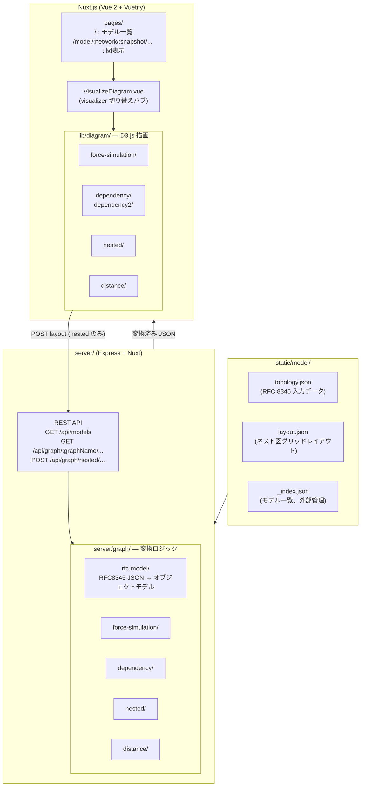

# Netoviz アーキテクチャ

## 概要

Netoviz は [RFC 8345](https://datatracker.ietf.org/doc/rfc8345/) に基づくネットワークトポロジデータをブラウザ上でインタラクティブに可視化する Web アプリケーションです。

**入力**: Netomox が生成した `topology.json` (RFC 8345 形式 JSON)
**出力**: 複数の描画方式によるインタラクティブな SVG 図

---

## 全体アーキテクチャ



---

## ディレクトリ構成

```
netoviz/
├── server/                     サーバーサイド
│   ├── index.js                エントリポイント (Express + Nuxt 起動)
│   ├── api/
│   │   ├── rest/
│   │   │   ├── index.js        Express Router (3エンドポイント定義)
│   │   │   └── integrator.js   グラフ変換の委譲ハブ (RESTIntegrator)
│   │   └── common/
│   │       ├── api-base.js     APIBase: ファイル読込・変換共通処理
│   │       └── alert-util.js   alertHost 文字列のパース
│   └── graph/
│       ├── rfc-model/          RFC 8345 JSON → オブジェクトモデル
│       │   ├── topology.js     RfcTopology (ルートクラス)
│       │   ├── network.js      RfcNetwork
│       │   ├── node.js         RfcNode
│       │   ├── link.js         RfcLink
│       │   ├── term-point.js   RfcTermPoint
│       │   ├── model/          拡張ネットワーク型 (L2/L3/MDDO系)
│       │   ├── node-attr/      ノード属性拡張
│       │   ├── tp-attr/        TP 属性拡張
│       │   ├── link-attr/      リンク属性拡張
│       │   └── network-attr/   ネットワーク属性拡張
│       ├── force-simulation/   ForceSimulation 図用変換
│       ├── nested/             Nested 図用変換 (最も複雑)
│       ├── dependency/         Dependency 図用変換 (v1/v2 共通)
│       ├── distance/           Distance 図用変換
│       └── common/
│           ├── base.js         BaseContainer (sortUniq, flatten)
│           ├── diff-state.js   差分状態管理
│           └── diff-element.js 差分要素
│
├── lib/                        フロントエンド描画ライブラリ
│   ├── diagram/
│   │   ├── common/
│   │   │   ├── diagram-base.js           D3 SVG 基盤 (server/graph/common/base.js を import)
│   │   │   ├── multilayer-diagram-base.js REST 呼び出し・複数レイヤー描画基盤
│   │   │   └── tooltip-creator.js        ツールチップ
│   │   ├── nested/             Nested 図 D3 描画
│   │   │   ├── visualizer.js   最上位 (saveLayout / clickHook)
│   │   │   ├── operator.js     インタラクション (ズーム/ドラッグ/ハイライト)
│   │   │   ├── builder.js      SVG DOM 構築
│   │   │   └── link-creator.js リンク描画
│   │   ├── dependency/         Dependency 図 D3 描画 (垂直レイアウト)
│   │   ├── dependency2/        Dependency2 図 D3 描画 (水平レイアウト)
│   │   ├── force-simulation/   Force-simulation 図 D3 描画
│   │   └── distance/           Distance 図 D3 描画
│   └── style/                  SCSS スタイル (diff ハイライト含む)
│
├── components/                 Vue コンポーネント
│   ├── VisualizeDiagram.vue             visualizer 切り替えハブ
│   ├── VisualizeDiagramNested.vue       Nested 図 UI
│   ├── VisualizeDiagramDependency.vue   Dependency 図 UI
│   ├── VisualizeDiagramDependency2.vue  Dependency2 図 UI
│   ├── VisualizeDiagramForceSimulation.vue
│   ├── VisualizeDiagramDistance.vue
│   ├── AppAPICommon.vue                 REST API URL 構築 mixin
│   ├── VisualizeDiagramCommon.vue       ライフサイクル管理 mixin
│   └── TableDiagrams.vue               トップページのモデル/visualizer 一覧表
│
├── pages/
│   ├── index.vue               / → TableDiagrams
│   └── model/_network/_snapshot/_modelFile.vue  動的ルート → VisualizeDiagram
│
├── store/
│   ├── index.js                modelFiles, visualizers 一覧
│   └── alert.js                alertHost 状態管理
│
├── static/model/               トポロジデータ置き場 (通常は外部マウント)
│   └── <network>/<snapshot>/
│       ├── topology.json       RFC 8345 入力データ
│       └── layout.json         ネスト図グリッドレイアウト
│
├── nuxt.config.js
├── dot.env                     .env テンプレート
└── Dockerfile                  node:22-alpine ベース
```

---

## 主要処理フロー

### 1. 図の表示 (例: ネスト図)

```
ブラウザ → /model/mddo-ospf/emulated_asis/topology.json?visualizer=nested
  → pages/model/_network/_snapshot/_modelFile.vue
  → VisualizeDiagram.vue → VisualizeDiagramNested.vue
  → mounted() → new NestedDiagramVisualizer(apiParam)
  → drawRfcTopologyData()
      → GET /api/graph/nested/mddo-ospf/emulated_asis/topology.json?reverse=...
          [server]
          → RESTIntegrator.toNestedTopologyData()
          → APIBase.toForceSimulationTopologyData() → RfcTopology (JSON parse)
          → _toNestedTopologyData() → DeepNestedTopology.initialize() → toData()
      → 受け取った JSON を D3.js で SVG 描画
```

### 2. モデル一覧ページ

```
ブラウザ → /
  → TableDiagrams.vue → GET /api/models
      [server] → static/model/_index.json を読んで返す
  → modelFiles を Vuex store に commit → テーブル描画
```

### 3. ネスト図レイアウト保存

```
"Save Layout" クリック
  → NestedDiagramVisualizer.saveLayout()
  → POST /api/graph/nested/<network>/<snapshot>/topology.json
      [server] → RESTIntegrator.postGraphData()
      → static/model/<network>/<snapshot>/layout.json を読み込み
      → grid データを上書きして fs.writeFile
```

### 4. diff (差分) 表示

```
topology.json の各要素に "_diff_state_" フィールドが含まれる場合
  → RfcModelBase._constructDiffState() → DiffState オブジェクト生成
  → DiffState.detect() → 'added' | 'deleted' | 'changed' | 'kept'
  → フロントエンドが SVG 要素に CSS クラスを付与 → lib/style/ で色付け
```

---

## 重要データモデル

### RFC 8345 入力フォーマット

```json
{
  "ietf-network:networks": {
    "network": [
      {
        "network-id": "ospf_area0",
        "network-types": { "mddo-topology:ospf-area-network": {} },
        "node": [
          {
            "node-id": "RouterA",
            "ietf-network-topology:termination-point": [
              { "tp-id": "Ethernet1", "supporting-termination-point": [...] }
            ],
            "supporting-node": [...]
          }
        ],
        "ietf-network-topology:link": [...],
        "supporting-network": [...]
      }
    ]
  }
}
```

### 拡張ネットワーク型

`network-types` キーに応じてサーバーがクラスを選択する:

| network-types キー | クラス |
|---|---|
| `ietf-l2-topology:l2-topology` | `RfcL2Network` |
| `ietf-l3-unicast-topology:l3-unicast-topology` | `RfcL3Network` |
| `mddo-topology:layer1-network` | `MddoL1Network` |
| `mddo-topology:layer2-network` | `MddoL2Network` |
| `mddo-topology:layer3-network` | `MddoL3Network` |
| `mddo-topology:ospf-area-network` | `MddoOspfAreaNetwork` |
| `mddo-topology:bgp-proc-network` | `MddoBgpProcNetwork` |
| `mddo-topology:bgp-as-network` | `MddoBgpAsNetwork` |

### オブジェクト ID 体系

```
数値 ID = LL * 100000 + NNN * 1000 + TTT
  LL  = ネットワーク番号
  NNN = ノード番号
  TTT = TP 番号
```

### パス文字列

`__` でセパレートした階層パス:
- ネットワーク: `<network>`
- ノード: `<network>__<node>`
- TP: `<network>__<node>__<tp>`

URL 上のスナップショット名は `/` → `__` にエンコードされる。

### diff 状態

```
DiffState.forward / .backward = 'added' | 'deleted' | 'changed' | 'kept'
DiffElement = [typeSign, jsonpath, before, after]
```

---

## ビジュアライザーの比較

| | dependency | dependency2 |
|---|---|---|
| レイアウト方向 | 垂直 | 水平 |
| 依存線 | `linkVertical` | `linkHorizontal` |
| TP 表示 | 常に表示 | クリックで展開/折りたたみ |
| ドラッグ | なし | ノードドラッグ対応 |
| サーバー変換 | 共通 (`server/graph/dependency/`) | 同左 |

どちらも同じ情報を異なる表現で可視化するもので、両方現役。

---

## 変更時の注意点

| 注意点 | 影響範囲 |
|---|---|
| `static/model/<network>/<snapshot>/topology.json` のパス構造を変えると URL も変わる | URL 設計・データ管理 |
| スナップショット名に `__` を含むと URL エンコードと衝突する | URL/ファイルパス |
| `lib/diagram/` が `server/graph/common/base.js` を直接 import している | バンドル・テスト |
| `_index.json` は自動生成されない (外部管理) | データ管理 |
| `layout.json` は `postGraphData` で上書き保存される | データ管理 |
| オブジェクト ID に上限がある (`LL NNN TTT` 体系) | 大規模トポロジ |
| テストコードがゼロ | 品質保証 |
| Nuxt 2 (Vue 2) はサポート終了済み | 将来的な移行コスト |
